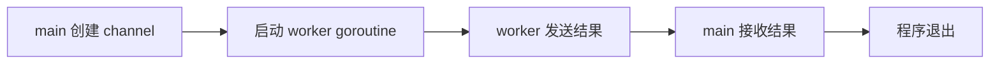

# Goroutine 入门

## 最小示例

```go
func worker(out chan<- string) {
    out <- "done"
}

func main() {
    out := make(chan string)
    go worker(out)
    msg := <-out
    fmt.Println(msg)
}
```

## 执行流程


