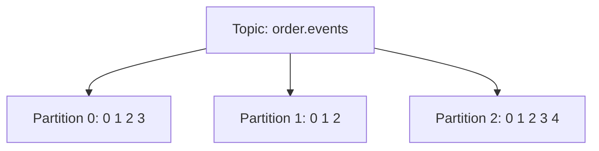

# Topic / Partition / Offset 模型

## Topic: 业务语义分组

`Topic` 用于承载同一类事件，例如:

- `order.created`
- `payment.succeeded`
- `inventory.changed`

Topic 是逻辑概念，真正存储发生在分区里。

## Partition: 物理并行与扩展单元

一个 Topic 会拆成多个 `Partition`，每个分区是追加写日志:

- 分区内 `Offset` 单调递增。
- 分区之间无全局顺序。
- 吞吐扩展通常通过增加分区和消费者并行度实现。

## Offset: 消费进度锚点

`Offset` 是消费者定位消息的位置:

- 消费者从某个 offset 开始拉取。
- 提交 offset 表示“处理进度”。
- offset 不是消息 ID，不能跨分区比较大小。

## 关键设计决策

1. 分区数: 决定未来并行上限，后续可加但会带来再分配成本。
2. 分区键: 决定消息落在哪个分区，直接影响顺序性与热点。
3. 保留策略: 时间/大小保留，或日志压缩（compaction）策略。

## 常见误区

- 误区: Kafka 天然全局有序。  
  事实: 只有“同一分区内有序”。

- 误区: offset 越大消息越新（全局）。  
  事实: 仅在同一分区中成立。

