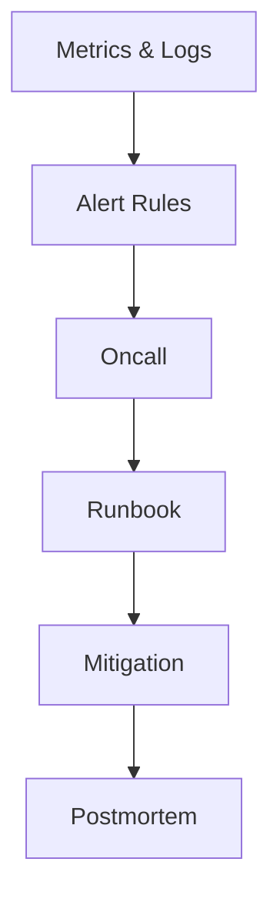

# 运维与监控清单

## 监控要覆盖三层

1. 集群层: Broker 健康、分区副本状态。
2. 客户端层: Producer/Consumer 错误率与重试行为。
3. 业务层: 消费滞后、端到端延迟、消息堆积时长。

## Broker 侧关键指标

- `UnderReplicatedPartitions`
- `OfflinePartitionsCount`
- 请求处理延迟（Produce/Fetch）
- 磁盘使用率与可用空间
- 网络吞吐与连接异常

`UnderReplicatedPartitions` 持续高位通常是优先级最高的集群告警之一。

## Consumer 侧关键指标

- `consumer_lag`（按 topic/partition/group 观察）
- 重平衡频次（rebalance）
- 消费失败率与重试次数
- 处理耗时分位数（P95/P99）

## 告警建议

- 先告“趋势持续异常”，再告“瞬时尖峰”。
- 分级告警:
  - P1: 分区离线、ISR 大面积异常、消费停摆
  - P2: Lag 持续增长、重平衡频繁
  - P3: 延迟轻微抖动、资源接近阈值

## 巡检清单（建议日常执行）

- Topic 分区与副本分布是否倾斜。
- 是否存在长期高 lag 的消费者组。
- 磁盘增长趋势是否接近保留策略上限。
- 最近是否有异常 rebalance 或 broker 重启风暴。

## 故障处理原则

- 先恢复可用性，再追求最优性能。
- 避免在故障中同时改多个关键参数。
- 事后沉淀 runbook，减少下一次响应时间。

