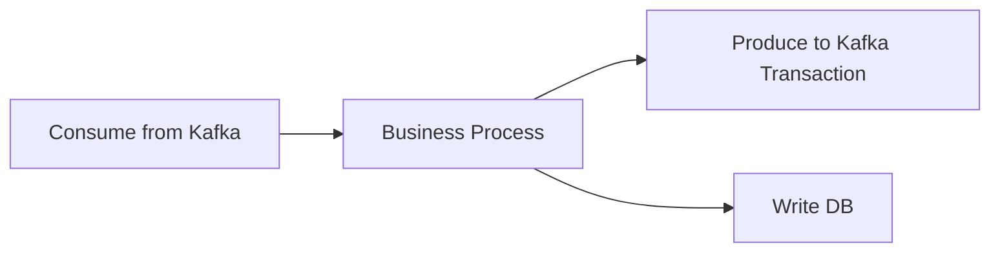

# 事务与 EOS 边界

## EOS 解决了什么

Kafka 的 EOS（Exactly-Once Semantics）主要解决:

- 生产端重复写入
- 消费-处理-回写 Kafka 链路中的重复可见

它依赖三类机制:

- 生产者幂等（`enable.idempotence=true`）
- 事务写入（`transactional.id`）
- 消费端 `read_committed`

## EOS 没解决什么

只要链路跨出 Kafka，就要重新定义边界:

- 写外部数据库: 仍可能出现“Kafka 提交成功，DB 失败”或反向情况。
- 调外部 HTTP 服务: 请求重试仍可能产生副作用。

结论:

- EOS 不是全系统事务。
- “不重不丢”必须以明确的系统边界描述。

## 典型链路分析

在上图中:

- `A -> C` 可通过 Kafka 事务保障较强语义。
- `B -> D` 仍需业务幂等键、补偿或 outbox 模式。

## 工程建议

1. 先写“语义说明书”，明确每段链路的保证级别。
2. 对外部系统写入使用幂等键与去重表。
3. 失败恢复优先保证可重放，而不是一次性“绝不重复”幻想。

