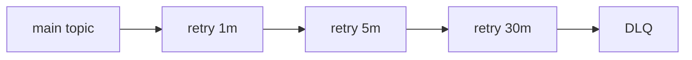

# 实战案例：延迟重试与死信队列

## 问题背景

消费失败不可避免，但如果直接无限重试会导致:

- 消费阻塞
- 重复风暴
- 整体 lag 飙升

## 分层重试模型

常见做法:

- 主 Topic 消费失败 -> 投递到 `retry.1m`
- 再失败 -> `retry.5m`
- 再失败 -> `retry.30m`
- 最终失败 -> `dlq`

## 关键字段

每条重试消息建议带上:

- `retryCount`
- `firstFailureAt`
- `lastErrorCode`
- `traceId`

## 实施原则

1. 重试必须有上限，不做无限回投。
2. 区分可重试错误与不可重试错误。
3. 死信队列必须接入告警与人工处理流程。

## 运营建议

- 每日统计 DLQ 数量与错误分类。
- 对高频错误做根因治理，而不是只加重试层级。

