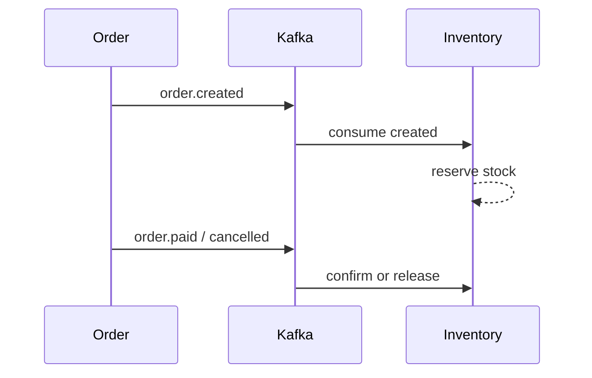

# 实战案例：库存扣减链路

## 核心挑战

库存场景通常同时面临:

- 高并发写入
- 重复消息
- 乱序与回滚需求

## 事件驱动方案

推荐链路:

1. `order.created` 触发预扣库存。
2. `order.paid` 确认扣减。
3. `order.cancelled` 释放库存。

## 一致性策略

- 业务状态机: `INIT -> RESERVED -> CONFIRMED/RELEASED`
- 幂等键: `orderId + eventType`
- 去重表或唯一约束避免重复扣减

## 失败恢复

- 消费失败进入重试队列
- 超过阈值进入死信队列并告警
- 提供人工补偿接口用于极端异常

## 落地建议

1. 不要把“扣减成功”仅绑定一次消费结果。
2. 保留可重放日志，支持按订单回溯。
3. 在压测中验证极端并发下状态机是否闭环。

