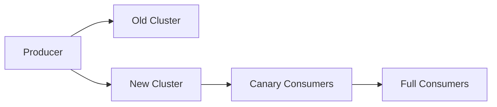

# 实战案例：迁移与切流

## 迁移目标

常见迁移诉求:

- 老集群容量不足
- 版本升级
- 机房或云环境迁移

核心目标是“可回退、可观测、可验证”。

## 迁移策略

推荐灰度切流:

1. 双写阶段: 生产端同时写新旧集群。
2. 对账阶段: 比较消息量与关键业务指标。
3. 消费切流: 消费者分批切换到新集群。
4. 下线旧链路: 稳定观察后停止旧集群流量。

## 切流检查清单

- Topic/分区/副本配置是否一致
- ACL 与配额是否完整迁移
- 延迟、错误率、lag 是否达标
- 回退开关是否可用

## 回退策略

- 任何关键指标异常，立即切回旧集群消费
- 保留双写窗口直到稳定期结束
- 回退后复盘根因，再二次灰度

## 结论

- 迁移失败多数不是技术细节，而是缺少演练与回退预案。
- 先保证可回退，再追求一次性切换成功。

