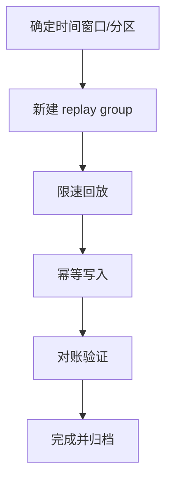

# 实战案例：消息回放与补数

## 典型触发场景

- 下游程序 Bug 导致历史数据处理错误
- 新功能上线需要重算历史状态
- 部分分区消费中断后需要补处理

## 回放策略选择

1. 同组回退 offset 回放（风险高，影响线上消费）。
2. 新建回放消费者组（推荐，隔离风险）。
3. 导出后离线重算（适合复杂补数逻辑）。

## 安全回放流程

## 风险控制点

- 必须限速，避免挤压线上资源。
- 必须幂等，避免二次污染数据。
- 必须对账，验证修复是否完整。

## 实战建议

1. 回放前冻结相关业务变更窗口。
2. 先小样本验证，再扩大范围。
3. 记录 replay 任务元数据，支持审计与复盘。

