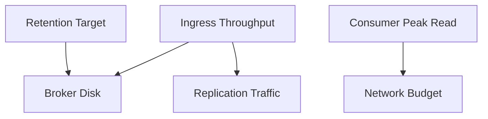

# 容量规划方法

## 先收集输入参数

容量估算至少需要:

- 峰值写入吞吐（MB/s）
- 峰值读取吞吐（MB/s）
- 消息保留时长（小时或天）
- 副本因子（replication factor）
- 预留冗余比例

## 粗略存储估算

可用一个实用公式:

`总存储 ≈ 写入吞吐 * 保留时长 * 副本因子 * 安全系数`

其中安全系数建议预留 1.2 ~ 1.5，覆盖突发与增长。

## 分区规划思路

- 分区数决定消费并行上限。
- 分区过少会限制吞吐。
- 分区过多会增加元数据与调度开销。

建议按“未来 6~12 个月峰值”规划，而不是只看当前流量。

## 网络与磁盘预算

Kafka 的瓶颈常在 I/O:

- 写路径需要考虑复制流量开销。
- 读路径要考虑回放与补消费峰值。
- 磁盘必须保证稳定顺序写性能和足够空余。

## 规划流程建议

1. 基于历史流量建立峰值模型。
2. 计算存储与网络预算。
3. 用压测验证单 broker 上限。
4. 预留扩容策略（分区扩展、broker 扩容、迁移窗口）。

## 常见误区

- 只按平均流量估算，不按峰值估算。
- 忽略副本和重平衡期间额外流量。
- 没有扩容预案，导致线上临时救火。

