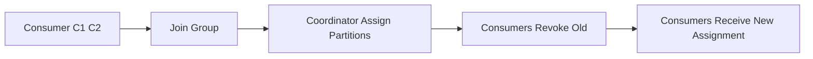

# Consumer Group 基础

## 为什么需要 Consumer Group

消费者组提供两种能力:

- 扩展: 多实例并行消费不同分区。
- 容错: 某实例宕机后分区可分配给其他实例继续消费。

同一组内:

- 一个分区同一时刻只会分配给一个消费者实例。
- 组内实例数超过分区数时，会有空闲消费者。

## Rebalance（再均衡）

触发场景常见有:

- 消费者实例上下线。
- Topic 分区数变化。
- 订阅关系变化。

## Offset 提交策略

- 自动提交: 配置简单，但可能造成“处理未完成就提交”风险。
- 手动提交: 可在业务处理成功后再提交，语义更可控。

常用实践:

- 先处理业务，再提交 offset，优先保证至少一次（at-least-once）。
- 幂等消费逻辑要独立设计，不能只依赖 Kafka 客户端行为。

## 关键配置关注

- `enable.auto.commit`
- `auto.offset.reset`
- `max.poll.interval.ms`
- `max.poll.records`
- `session.timeout.ms`

## 常见问题

- 处理太慢导致 `max.poll.interval.ms` 超时，引发频繁 rebalance。
- 批处理过大导致提交延迟，故障时重复消费窗口扩大。

