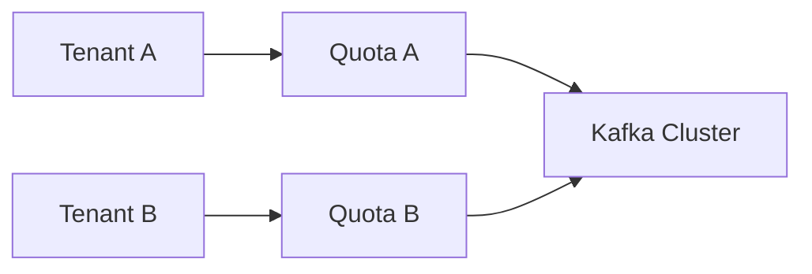

# 多租户隔离设计

## 多租户的核心风险

共享 Kafka 集群时，常见风险:

- 大租户突发流量拖垮小租户体验
- Topic 命名混乱导致治理困难
- 权限过宽带来数据泄漏风险

## 三层隔离模型

1. 资源隔离: 配额（produce/fetch）与连接控制。
2. 数据隔离: Topic 命名规范与分区规划。
3. 权限隔离: ACL 最小权限原则。

## 命名与治理建议

- Topic 统一前缀: `tenant.<id>.<domain>.<event>`
- 按环境分层: `dev/stage/prod` 严格分离
- 禁止“临时 Topic 常驻化”，建立清理机制

## 权限实践

- Producer 只授予写指定 topic 权限
- Consumer 只授予读指定 topic 与 group 权限
- 运维账号与应用账号分离，审计操作日志

## 运营指标

- 按租户统计吞吐、错误率、lag、失败重试
- 按租户设置容量预警，避免单租户失控拖垮全局

## 结论

- 多租户不是“只建多个 topic”。
- 必须同时设计配额、ACL、命名和监控，才有可持续隔离。

