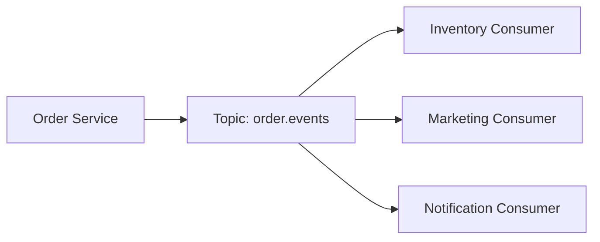

# 实战案例：下单事件链路

## 场景目标

业务要求:

- 用户下单后，订单、库存、营销、通知等服务并行处理。
- 下游失败不影响主链路可用性。
- 支持失败重试与审计追踪。

## 事件模型

推荐拆分事件:

- `order.created`
- `order.paid`
- `order.cancelled`

每条事件包含:

- 业务主键（如 `orderId`）
- 事件时间
- 幂等键（如 `eventId`）
- 版本号（用于演进）

## 参考架构

## 关键设计点

1. 分区键优先用 `orderId`，保证同订单事件有序。
2. 消费端按 `eventId` 做幂等去重。
3. 失败消息进入重试或死信链路，不阻塞主消费。

## 常见问题

- 问题: 下游偶发慢处理导致 lag 抖动。  
  处理: 分离慢消费者组，独立扩容与告警。

- 问题: 事件字段变更导致兼容性问题。  
  处理: 使用可选字段与版本策略，避免破坏老消费者。

