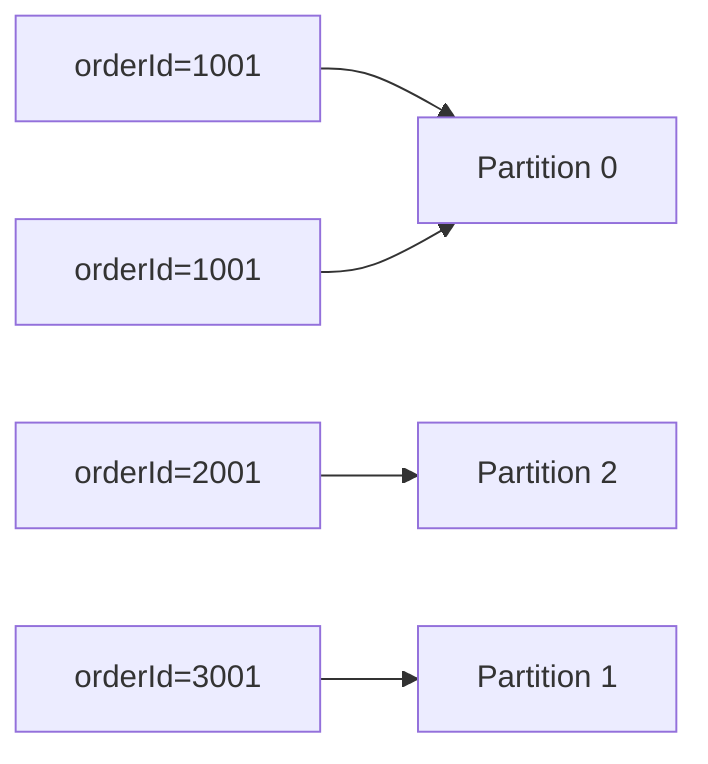

# 顺序性与分区键设计

## 顺序性边界

Kafka 的顺序性只在同一分区内成立:

- 同一分区: 生产顺序与消费顺序可保持一致。
- 跨分区: 不存在全局严格顺序。

这意味着“是否有序”本质是分区键设计问题。

## 分区键的作用

分区键（`key`）决定消息落到哪个分区:

- 相同 key -> 同一分区（通常可保证局部有序）。
- 不同 key -> 可能分散到不同分区（提升并行度）。

## 常见键选择策略

1. 按业务实体键: 如 `orderId`、`userId`。  
   优点是局部顺序好，缺点是可能有热点。

2. 无 key 轮询:  
   优点是负载均衡，缺点是无法保证同实体顺序。

3. 组合键: 如 `tenantId:userId`。  
   适合多租户隔离与顺序折中。

## 热点问题与缓解

热点通常来自“超级 key”:

- 单个 key 产生远高于平均值的流量。
- 导致某一分区吞吐、延迟、堆积异常。

缓解方式:

- 业务上拆 key（可接受弱化顺序时）。
- 对超热点实体做专门 Topic。
- 提前规划更高分区数并监控分区倾斜。

## 实战建议

- 先明确“必须有序”的业务实体，再选 key。
- 需要强顺序时，不要轻易改分区键规则。
- 扩分区前评估对 key 分布、消费并行和历史兼容的影响。

