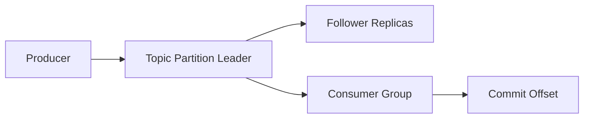

# Kafka 概览

## Kafka 解决什么问题

Kafka 是一个高吞吐、可持久化的分布式消息平台，核心目标是:

- 解耦系统: 生产者和消费者彼此独立演进。
- 扛住流量: 通过分区并行和顺序写盘支持大吞吐。
- 可回放: 消费位移可控，历史消息可重复消费。

## 核心术语

- `Topic`: 逻辑消息类别。
- `Partition`: Topic 的分片，消息有序追加在分片日志中。
- `Offset`: 消息在分区中的位置编号。
- `Producer`: 发送消息的客户端。
- `Consumer Group`: 以组为单位消费，同组内分区会被分配给不同消费者实例。
- `Broker`: Kafka 服务节点。

## 一条消息的基本路径

## 适合与不适合

适合:

- 异步解耦、日志采集、事件驱动架构、流式处理。

不适合:

- 强事务且低延迟强一致写场景（通常更适合数据库直写）。
- 小规模简单系统里为了 Kafka 而 Kafka。

## 你需要先记住的三件事

1. Kafka 的顺序性只在分区内成立。
2. 副本机制保障可用性，但语义依赖生产/消费端配置。
3. 想要稳定语义，必须同时设计 Producer、Consumer 与 Topic 参数。

