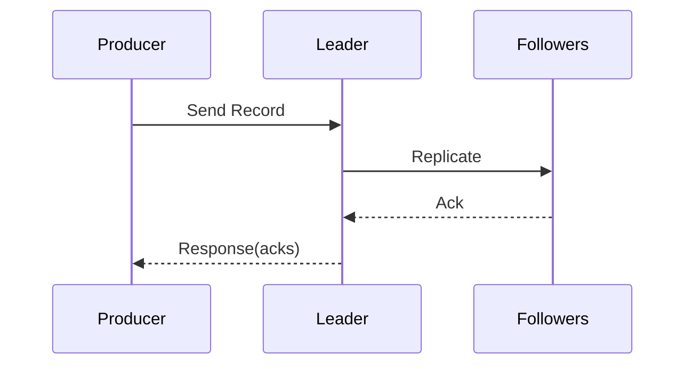

# Producer 基础

## 发送流程

生产者发送一条消息时通常经历:

1. 序列化消息。
2. 按 key 计算分区。
3. 批量聚合（batch）。
4. 发送给分区 leader。
5. 根据 `acks` 等待确认。

## 最关键参数

- `acks`
- `retries`
- `linger.ms`
- `batch.size`
- `compression.type`
- `enable.idempotence`
- `max.in.flight.requests.per.connection`

## 参数组合建议

高可靠优先:

- `acks=all`
- `enable.idempotence=true`
- `retries` 保持默认高值或按场景增大
- 配合服务端 `min.insync.replicas>=2`

吞吐优先:

- 增大 `batch.size`
- 合理增大 `linger.ms` 以提高批次利用率
- 开启压缩（如 `snappy` 或 `lz4`）

## 实战注意点

- 同 key 的消息会路由到同一分区，可利用这一点保证局部顺序。
- 不带 key 容易实现负载均衡，但会失去“按业务实体有序”能力。
- 只调生产者参数不够，Broker 端限流和磁盘能力同样关键。

