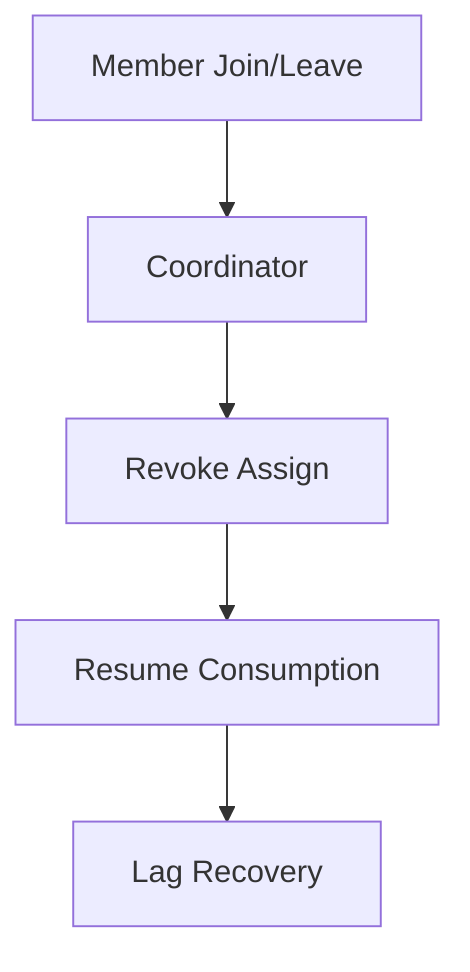

# Rebalance 优化

## 为什么 rebalance 会让系统抖动

重平衡期间，消费者会经历分区回收与重新分配:

- 消费短暂停止
- 缓存与本地状态失效
- 提交/处理时序更复杂

频繁 rebalance 会直接放大 lag 波动。

## 高频触发原因

- 消费者实例频繁重启或弹性伸缩过快
- 处理耗时过长导致 `max.poll.interval.ms` 超时
- Topic 分区频繁变更

## 关键优化手段

1. 采用 cooperative-sticky 分配策略（渐进式回收分区）。
2. 合理提高 `max.poll.interval.ms`，匹配真实处理耗时。
3. 控制单批处理大小，避免“超长批次”。
4. 优化部署策略，避免同时重启整组实例。

## 排查顺序

1. 看 rebalance 次数曲线是否异常上升。
2. 看 `max.poll.interval.ms` 相关超时日志。
3. 看实例发布与节点故障时间线是否重合。
4. 看业务处理耗时分位数是否超过阈值。

## 实战建议

- 把“高频 rebalance”作为 P1 稳定性问题治理。
- 将消费耗时和 rebalance 指标绑定看，不要只盯 lag。

