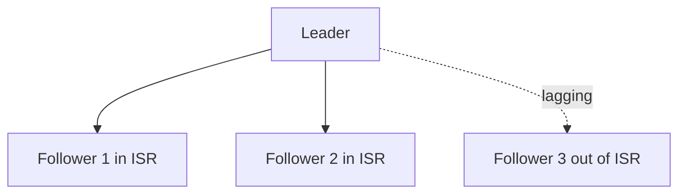

# 副本机制与 ISR

## 副本角色

每个分区通常有多个副本:

- `Leader`: 负责读写请求。
- `Follower`: 从 leader 拉取数据并追赶。

客户端只与 leader 通信，副本同步由 Broker 处理。

## ISR 是什么

`ISR`（In-Sync Replicas）表示与 leader 保持足够同步的副本集合。

- ISR 太小会降低容灾能力。
- `acks=all` 时，通常需要 ISR 中足够副本确认才返回成功。

## `acks` 与 `min.insync.replicas`

可靠写入常见组合:

- 客户端: `acks=all`
- 服务端: `min.insync.replicas=2`（示例值）

效果:

- 如果 ISR 少于最小值，写入会失败而不是“悄悄降级”，能显式暴露风险。

## 故障切换

当 leader 故障时:

1. 控制器从可用副本中选举新 leader。
2. 客户端感知元数据变化后切换目标 broker。
3. 消费者继续按分区拉取。

## 运维关注点

- 观察 `UnderReplicatedPartitions` 是否持续升高。
- 监控磁盘与网络，副本滞后常由资源瓶颈触发。
- 降低跨机房延迟波动，避免 ISR 频繁抖动。

